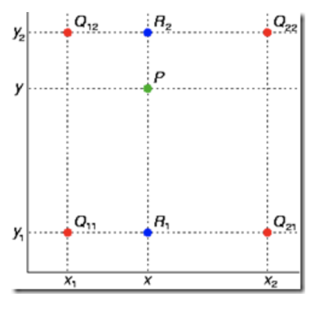
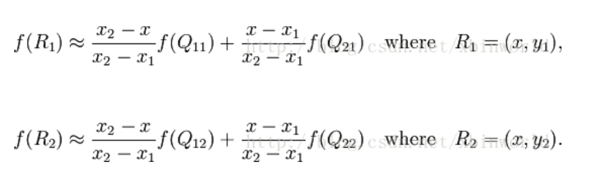
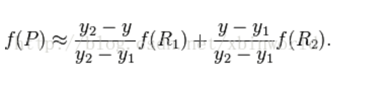
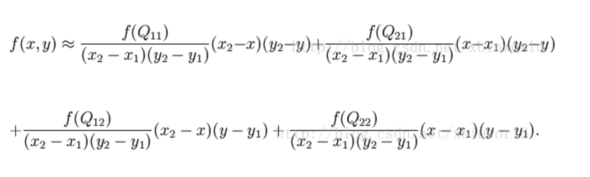

# Bilinear Interpolation

### Linear Interpolation

- 已知两点A B，要在AB中插入一点C，即在AB的连线上插入。可套用一次线性公式：

### 双线性

- 已知Q11, Q12, Q21, Q22，要在其中插入一点P。得到P点，需要两次线性插值，即双线性插值

1. 首先求出插值R1,	R2

2. 由插值R1,  R2求出插值P

3. 式子扩展化简即为

4. 若选择一个坐标系使得Q点为(0, 0), (0, 1), (1, 0), (1, 1)， 那么插值公式可以化简为矩阵形式