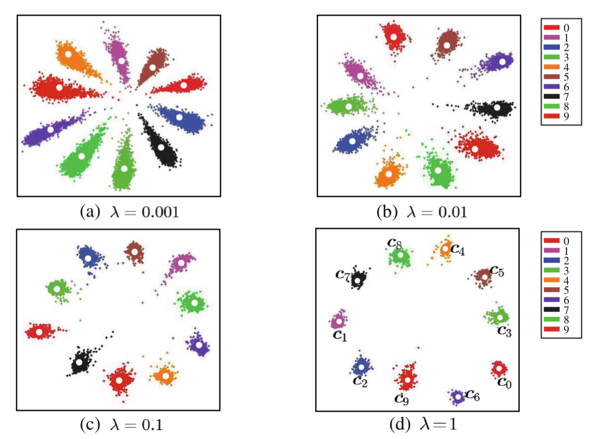
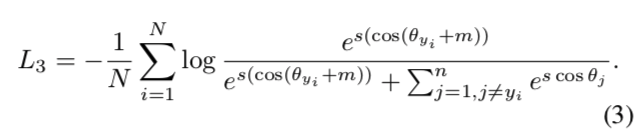
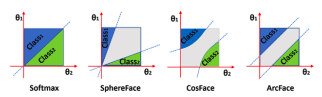
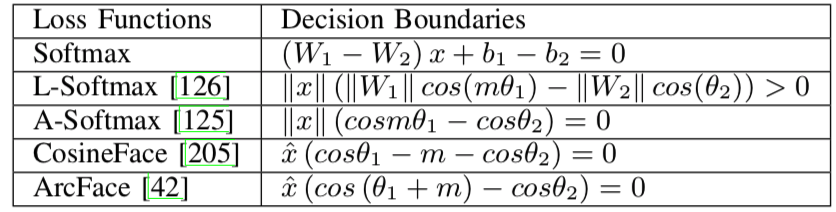

# Face Recognition

### Triplet Loss （FaceNet）

### Center loss

**discriminative feature learning algorithm**

- softmax loss 仅仅只能区分class间的异同，无法discriminate其差异的大小

- 为了 enhance intra-class compact，和inter-class discriminative。引入Center loss，使相同类别的class聚集在center附近

  - Center Loss:	$L_c = \frac{1}{2}\sum|| x_i - c_{yi}||_2^2$， 其中 $c_{yi}$ 表示 $yi$ class 的center

- Loss function: $L = L_s + \lambda L_c$
  $$
  L = -\sum log \frac{e^{W_{yi}^Tx_i + b_{yi}}}{\sum e^{W_{j}^Tx_i + b_{j}}} + \frac{\lambda}{2} \sum ||x_i - c_{yi}||_2^2
  $$
  ​					

  

### ArcFace

- 将softmax中 $W_{yi}^Tx_i = ||W_j|| \cdot ||x_i|| cos \theta_j$，通过L2正则使 $||Wj|| = 1$ ，$||x_i||$ rescale to $s$ 

- 计算 $arccos \theta_{yi}$ 得到feature $x_i$ 和 ground truth weight $W_{yi}$ 的角度

- ArcFace: 

  - 惩罚项m用来增大种内关系和种间差异 (enhance the intra-class compactness and inter-class discrepancy)

  

- Geometric Difference 几何差异

  - 虚线表示决策边界

### Margin of Lost

### 