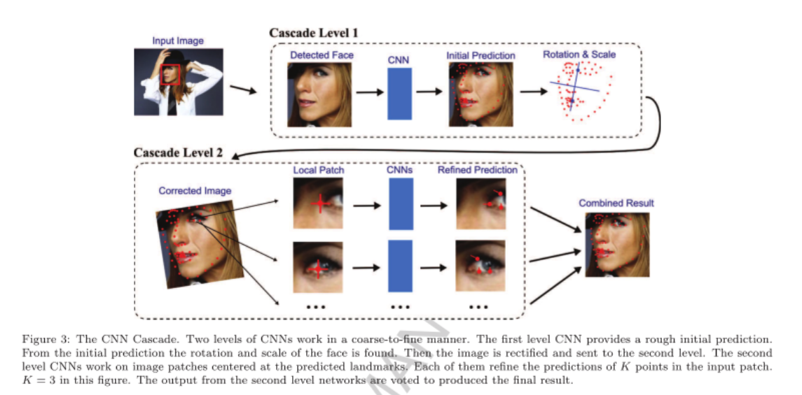
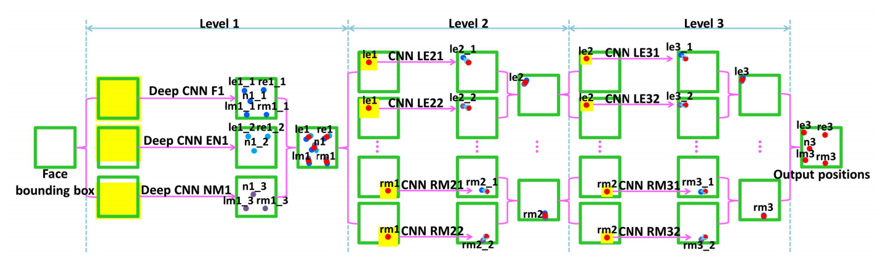
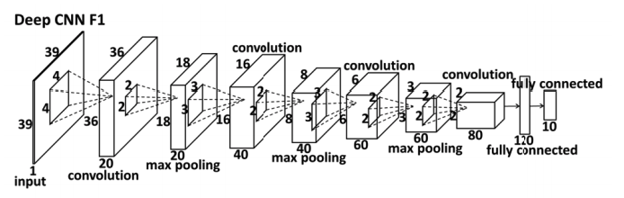
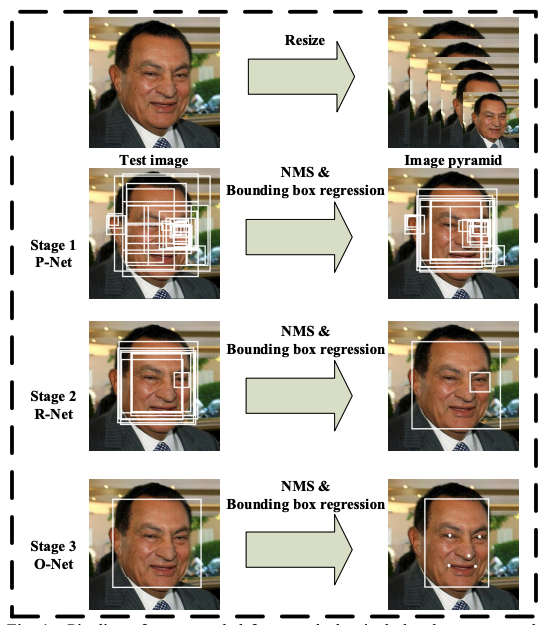
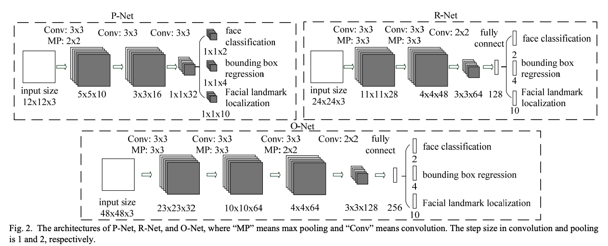

Face landmark Alignment

### Approaching Human Level Facial Landmark Localization by Deep Learning

难点：

1. 遮挡
2. 低分辨率
3. 光线
4. 模糊

方法对比：

- 常用landmark方法：将landmark看成是一个回归问题 (regression-based)

- 本文方法：CNN Cascade (deeplearning-based)

**Coarse-to-fine：**

1. 侦测人脸，粗略初始化landmark
2. 根据landmark进一步观测周遭area，refine landmark

---

### FacePoseNet：Making a Case for Landmark-free Face Alignment

**Introduction：**

- Facial landmark主要用作pipeline里面对齐，方便后续操作。但是更好的landmark并不意味更好的face alignment

**Critique of facial landmark detection:**

- Landmark detection accracy measures

  - inter-ocular distance, $L$= { $p_i$ } 属于set of m 2D facial landmark坐标，$L$ = {$\hat{p_i}$ 属于ground truth坐标，$\hat{p_l}, \hat{p_r}$ 为左右眼outer corner position。

    $$e(L, \hat{L}) = \frac{1}{m||\hat{p_l} - \hat{p_r}||_2} \sum_{i=1}^m ||p_i - \hat{p_i}||_2$$

- Landmark detection speed

  - 实时landmark detection准确率相对低
  - 目前没有landmark detector是基于GPU的，如今串行的优化方式难以convert to并行。

- Effects of facial expression and shape on alignment

---

### Deep Convolitional Network Cascade for Facial Point Detection (CVPR2013)

**Cascaded Convolutional networks: **

- Level 1: 3个CNN网络级联

  - F1: 回归5个点（左眼，右眼，鼻子，左嘴角，右嘴角）

  

  - EN1: 回归3个点（左眼，右眼，鼻子）**same structure with different size**
  - NM1: 回归3个点（左嘴角，右嘴角，鼻子）**same structure with different size**
  - output：将上面得到的11个点回归成5个点

- Level 2: 10个CNN网络级联

  - 输入位level1输出关键点附近(15x15)局部裁剪的图像，每两个CNN负责回归上一级输出的一个关键点

- Level 3：10个CNN网络级联

  - 输入为level2输出关键点附近的裁剪图像，每两个CNN负责回归上一级输出的一个关键点

**Locally-share Conv: **

- 全局权值共享（Fully Connected Layer）
  - 假设object出现在图片的任意地方
  - 防止bp的时候出现梯度消失，因为权值的梯度是aggregrated的。
  - 对具有fixed spatial layout（固定空间分布）的图片难以学习
- 局部权值共享（Conv）
  - 对于分割后的图片，卷积层更好的学习high level feature

### CFAN (ECCV2014)

**introduction：**

- AAM无法照顾到复杂的人脸外观，归咎于single linear model 无法cover 所有non-linear variations in facial appearance

### MTCNN (ECCV2016)

**Pipeline: **

- Stage 1: Proposal Network 获得候选框和回归向量，之后再用NMS对多余候选框进行删减
- Stage 2: Refine Network 候选框feed in CNN，进一步拒绝false candidates，校正候选框回归，进行NMS
- Stage 3: Output Network 定位5个人脸关键点

**Training: **

- 通过随机生成候选框将数据集分成四类：positive(IOU > 0.65)，negative（IOU < 0.3），partfaces（0.4<IOU<0.65），landmark
- positive和negative参与到分类任务，positive和partface参与回归任务，landmark参与关键点回归任务
  - Cross Entropy Loss for facial classification
  - L2 Loss for bounding box regression
  - L2 Loss for landmark localization
  - Multi-source training：$ min \sum^N_{i=1} \sum_{j\in (det,box,landmark) \alpha_j \beta^j_i L^j_i } $ 

**OHEM: **

- 在每一个mini-batch中，对forward propagation的loss排序（高到低），选择前70%的用作反向传播。这样的作用是忽略easy sample对于模型的训练作用。

### Mnemonic Descent Method: A recurrent process applied for end-to-end face alignment (CVPR2016)

### Deep Alignment Network (CVPR2017)

### Style Aggregated Network for Facial Landmark Detection (CVPR2018)
