## Object Classification

### 1. Inception 

#### Version 1

**模型特点：**

1. 采用<u>**不同大小的卷积核意味着不同大小的感受野，最后拼接意味着不同尺度特征的融合**</u>；
2. 之所以卷积核大小采用1、3和5，主要是为了方便对齐。**<u>设定卷积步长stride=1之后，只要分别设定pad=0、1、2，那么卷积之后便可以得到相同维度的特征，然后这些特征就可以直接拼接在一起了</u>**；
3. 文章说很多地方都表明pooling挺有效，所以Inception里面也嵌入了。
4. 网络越到后面，特征越抽象，而且每个特征所涉及的感受野也更大了，因此随着层数的增加，3x3和5x5卷积的比例也要增加。

但是，<u>**使用5x5的卷积核仍然会带来巨大的计算量**</u>。 为此，文章借鉴NIN2，采用1x1卷积核来进行通道削减。

例如：上一层的输出为100x100x128，经过具有256个输出的5x5卷积层之后(stride=1，padding=2)，输出数据为100x100x256。其中，卷积层的参数为128x5x5x256。假如上一层输出先经过具有32个输出的1x1卷积层，再经过具有256个输出的5x5卷积层，那么最终的输出数据仍为为100x100x256，但卷积参数量已经减少为128x1x1x32 + 32x5x5x256，大约减少了4倍。

**Inception Block结构：**

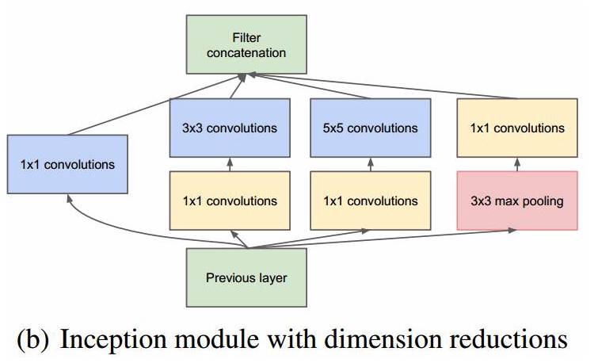


**模型结构：**

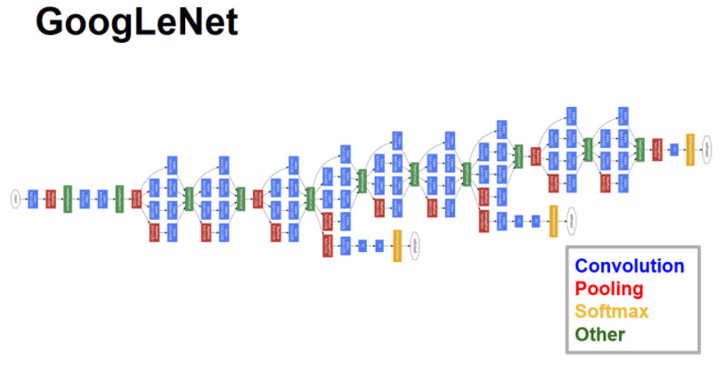

---

#### **Version 2**

**模型改进：**

1. 使用BN层，将每一层的输出都规范化到一个N(0,1)的正态分布，这将有助于训练，因为下一层**<u>不必学习输入数据中的偏移，并且可以专注与如何更好地组合特征</u>**（也因为在v2里有较好的效果，BN层几乎是成了深度网络的必备）；**<u>BN层能够提升模型的训练速度</u>**

**Inception Block结构：**

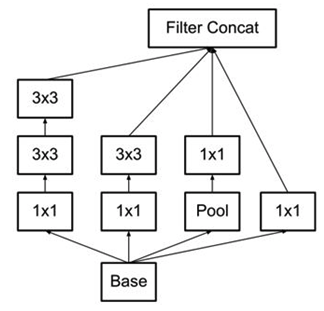


**Result on ImageNet：**

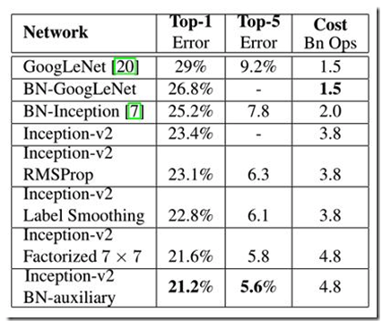


#### Version 4

**Inception Block：**

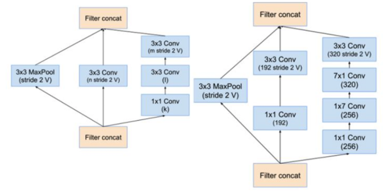


#### Conclusion：

- Inception网络模式人工痕迹太重，模型太复杂。容易过拟合。
- 模式属于split-transform-merge模式，每一路通道进行单独转换，最后所有通道concate（级联）
- 版本越往后面参数越多，训练所花费的时间和资源越多

---


### 2. ResNet

---

- **模型结构**


### 3. ResNext

---

**模型特点：**

1. 在ResNet模型的基础上增加了Residual Block的宽度（通道），检验了模型宽度所带来的精度提升。
2. 最后所有通道仅仅是相加起来便可以融合。符合split-transform-merge模式
3. 进一步验证了split-transform-merge模式的普遍性和有效性

**ResNext Block：**

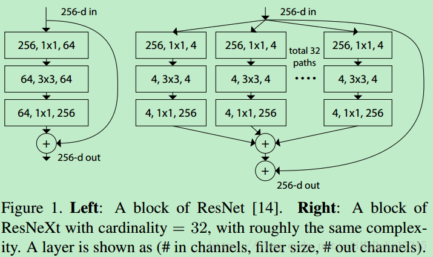

- 左ResNet							右ResNext（32 Paths）

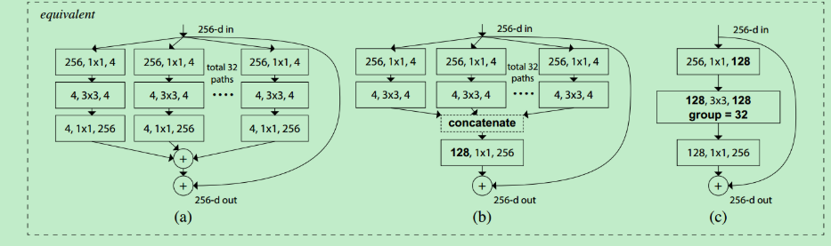

- a为基本的ResNext Block单元
- 如果将最后1x1的合并到一起，等价于网络b中拥有和Inception-ResNet的结构（concate）
- 进一步将输入的1x1合并，等价于网络c中和通道分组卷积网络结构类似

#### Conclusion：

- ResNext-101 （32x4d）大小和Inception v4相当，精度略差。但是训练速度快很多
- ResNext-101 （64x4d）大小和Inception-ResNet大一点，精度相当或略差，速度快非常多
- 结构简单，可以防止对特定数据集的过拟合。

---


### 4. VGG

**模型特点**

1. 整个网络都使用了同样大小的卷积核尺寸（3 x 3）和最大池化尺寸（2 x 2）
2. 1 x 1卷积的意义主要在于线性变换，而输入通道数和输出通道数不变，没有发生降维。
3. 两个3 x 3的卷积层串联相当于1个5 x 5的卷积层，即一个像素会跟周围5 x 5的像素产生关联，可以说感受野大小为5 x 5。而3个3 x 3的卷积层串联的效果则相当于1个7 x 7的卷积层。除此之外，3个串联的3 x 3的卷积层，拥有比1个7 x 7的卷积层更少的参数量，只有后者的(3 x 3 x 3)/(7 x 7)=55%。最重要的是，3个3 x 3的卷积层拥有比1个7 x 7的卷积层更多的非线性变换（前者可以使用三次ReLU激活函数，而后者只有一次），使得CNN对特征的学习能力更强。
4. VGGNet在训练时有一个小技巧，先训练级别A的简单网络，再复用A网络的权重来初始化后面的几个复杂模型，这样训练收敛的速度更快。在预测时，VGG采用Multi-Scale的方法，将图像scale到一个尺寸Q，并将图片输入卷积网络计算。然后在最后一个卷积层使用滑窗的方式进行分类预测，将不同窗口的分类结果平均，再将不同尺寸Q的结果平均得到最后结果，这样可提高图片数据的利用率并提升预测准确率。在训练中，VGGNet还使用了Multi-Scale的方法做数据增强，将原始图像缩放到不同尺寸S，然后再随机裁切224x224的图片，这样能增加很多数据量，对于防止模型过拟合有很不错的效果。

**模型结构**

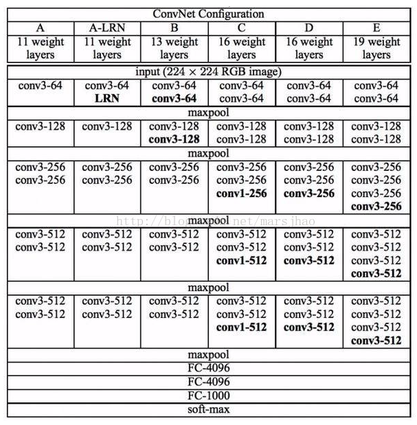

---


### 5. ZFNet & AlexNet

---

### 6. SE-Net

**模型特点：**

- 通过feature recalibration（重校正）给channel增加权重，提升每个channel的表征特性（channel和feature map之间的明确关系）
- 

**模型结构：**

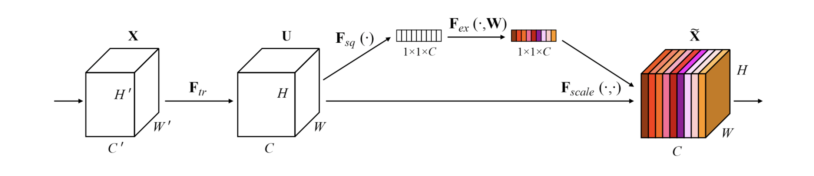

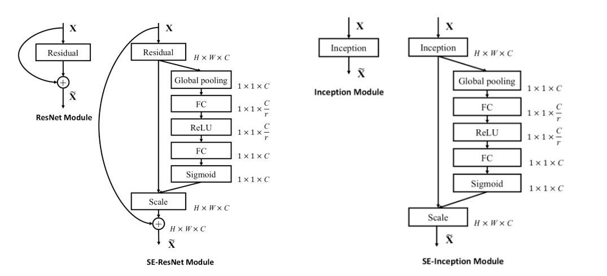

- 通过Global Pooling将输出的feature map pooling 至 $1 \times 1 \times C$
- 将其映射至FC layer 至 $1\times 1\times \frac{C}{r}$ 并通过非线性激活函数Relu
- 将上一步输出映射至 $1\times 1\times C$ 的FC layer。两次FC的操作是为了
  - 具有更多非线性，更好拟合通道间相关性 
  - 降低参数量和
- 通过sigmoid之后将$1 \times 1 \times C$ 的权重与$H \times W \times C$ 一一相乘得到结果

模型变体：

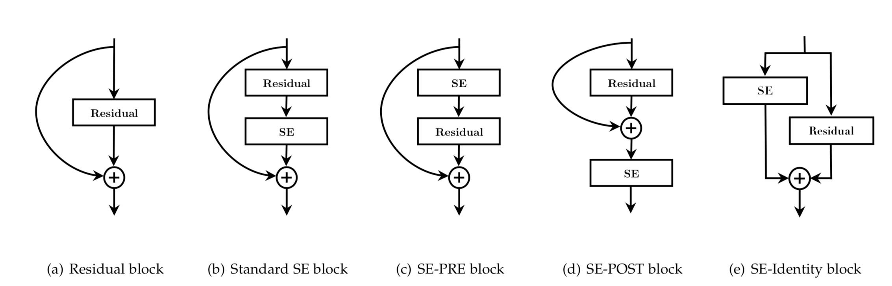

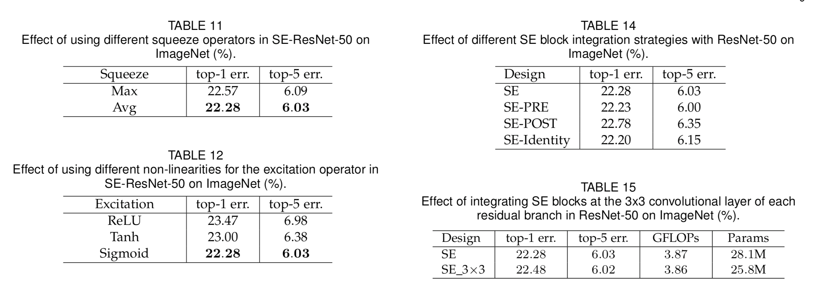

---

### 7. Shuffle Net

**模型特点：**

- 轻便， $shuffle$  operation help information flowing across feature channel

**Group Convolution：**

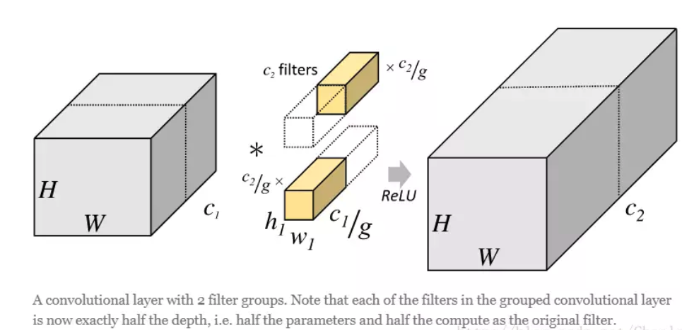

- 将channel数 c 分成g各组，每个组的channel数量为c/g
- 每个组的输出结果进行concatenate组合恢复到原来的channel数量
  - e.g. 假设原来输入通道数：256，输出通道数：256，kernal size： 3x3，overall parameter：256x3x3x256 = 589824
  - 使用group channel之后：假设group = 8，每个group通道：256/8 = 32，overall parameter：8x32x3x3x32 = 73728

**Channel Shuffle Operation:**

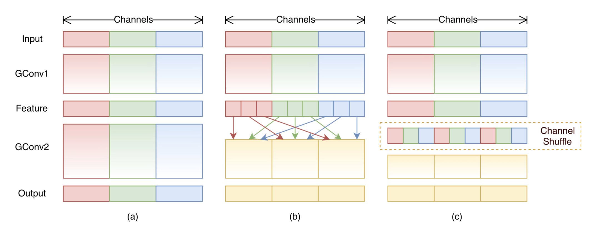


- a：两个conv之间没有交流，每个output channel只与input channels 相关
- b：input channel 和 output channel之间充分交流
- c：使用shuffle操作达到 **b** 的效果

**ShuffleNet Unit**

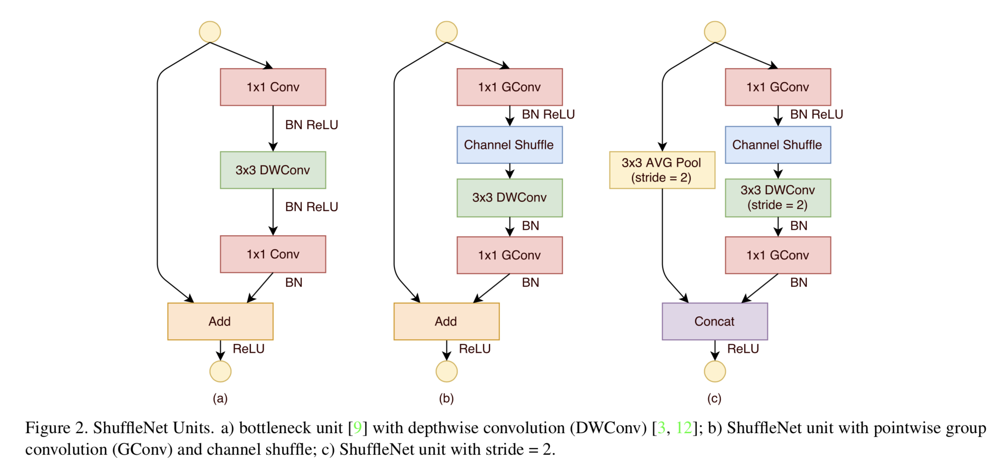

- a：vanilla ResNext
- b：使用1x1 group conv替代1x1 conv 并加入了channel shuffle
- c：ShuffleNet with stride **enlarge channel size with little extra computation cost**

---

### 8. Xception

- **Deepwise Convolution Block: **

  ```python
  class SeparableConv2d(nn.Module):
      def __init__(self,in_channels,out_channels,kernel_size=1,stride=1,padding=0,dilation=1,bias=False):
          super(SeparableConv2d,self).__init__()
  
          self.conv1 = nn.Conv2d(in_channels,in_channels,kernel_size,stride,padding,dilation,groups=in_channels,bias=bias)
          self.pointwise = nn.Conv2d(in_channels,out_channels,1,1,0,1,1,bias=bias)
  
      def forward(self,x):
          x = self.conv1(x)
          x = self.pointwise(x)
          return x
  ```

  - 先经过一个**group为** `in_channel` **的conv2d**，再经过1x1 conv

---

### 9.Octave Convolution

### 10.Siamese Network

- 模型作用：**少样本**图像分类，图像匹配，目标追踪

- 模型特点：

  - 相似性度量，淡化label作用

  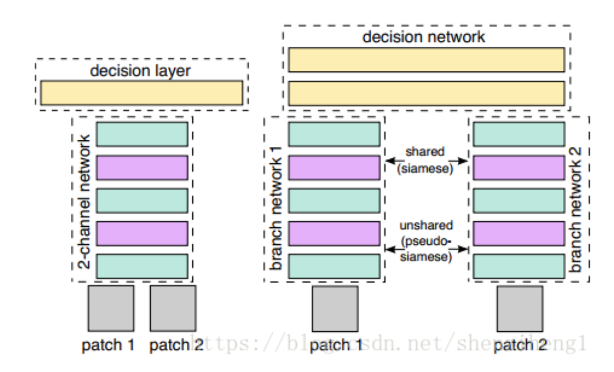

  - 步骤：

  1. 输入为**一对**图片，不需要label；若来自同一class，则为1，反之为0。
  2. 两张图片经过同一个共享参数的神经网络
  3. 将最后一层的输出作为**encoding**，度量两个encoding的相似性(欧式距离)
  4. 输出为score，越高代表越相似。