## **Object Detection Models**

### **Two-Stage：**

### 1. R-CNN

**模型特点：**

1. 使用CNN队Region Poposals 计算feature vectors。从经验驱动特征（HOG，SIFT）到数据驱动特征（CNN feature Map），提高特征对样本的表示能力。

**R-CNN Pipeline**

1. pre-train neural network
2. 重新训练全连接层。
3. 提取proposals并计算CNN特征。利用selective search算法提取所有proposals，调整大小（wrap），满足CNN输入，然后将feature map保存本地磁盘
4. 训练SVM。利用feature map训练SVM来对目标和背景进行分类（每个类一个二分类SVM）
5. 边界框回归。训练将输出校正因子的线性回归分类器

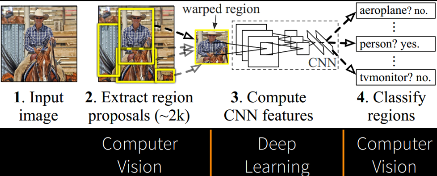

### 2. Faster R-CNN

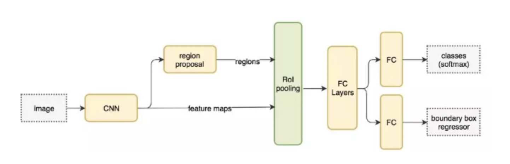

 模型特点：

1. 利用RPN代替最后一层的selective search

**RPN：**

1. 在最后一层Feature map上滑动一个3x3的卷积核，最后输出一个1x1x256 维的vector，送入两个FC进行bbox regression和obj分数(是否包含物体)。Obj分数通过生成的bbox和ground truth计算IOU得出。这两个objectiveness分数由两个分类器组成(带有目标的类别clf和不带有目标的类别clf)

   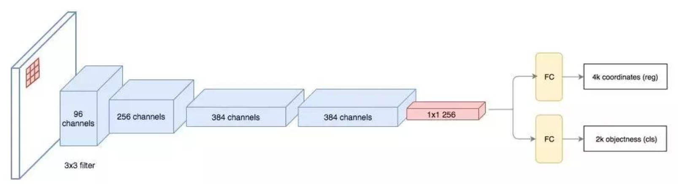

2. RPN对特征图每个位置做k次运算(k为Anchor Boxes数量)，然后输出4xk个坐标和2xk个得分

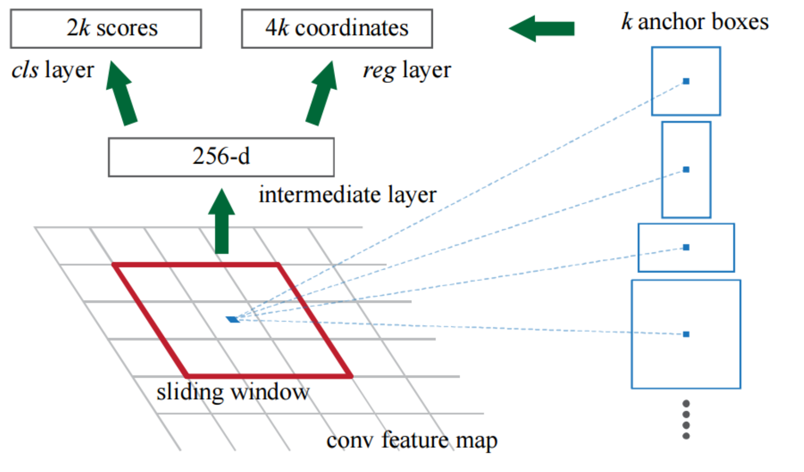

**Faster-RCNN Pipeline:**

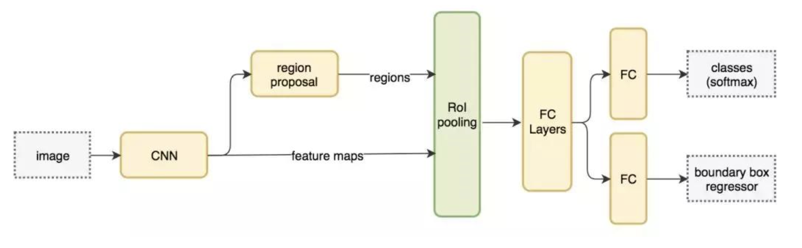

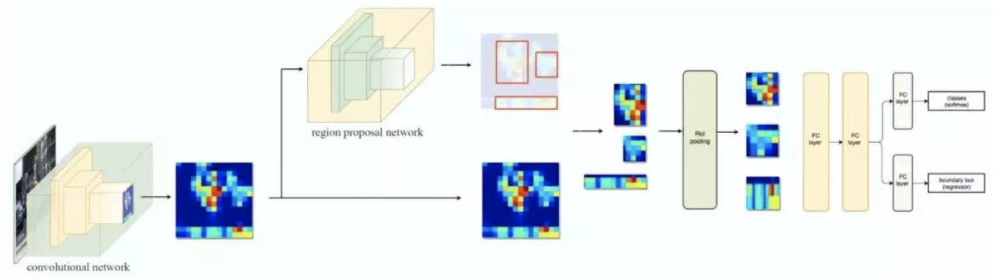

**RPN存在问题：**

1. 最小的Anchor尺度是128x128，而coco的小目标很多且尺度远小于这个。为了侦测到小目标，Faster-RCNN不得不放大输入image size，导致计算量增加，而同时大目标可能超过最大的anchor尺度（512x512）
2. 最大的anchor是512x512，而预测层感受野仅为228。一般来说，感受野一定要大于anchor大小
3. 小目标的anchor太少太稀疏，大目标的anchor太多太密集，造成计算冗余。需要忽略跨界边框才能使得模型收敛。

**ROI Pooling**:

- 输入:

  1. **特征图（feature map）**，指的是上面所示的特征图，在Fast RCNN中，它位于RoI Pooling之前，在Faster RCNN中，它是与RPN共享那个特征图，通常我们常常称之为“share_conv”；
  2. **RoIs**，其表示所有RoI的N*5的矩阵。其中N表示RoI的数量，第一列表示图像index，其余四列表示其余的左上角和右下角坐标。

- 具体操作：

  1. 根据输入image，将ROI映射到feature map对应位置

     注：映射规则比较简单，就是把各个坐标除以“**输入图片与feature map的大小的比值**”，得到了feature map上的box坐标**（一次量化）**

  2. 将映射后的区域划分为相同大小的sections（sections数量与输出的维度相同，**二次量化**）

     - **不能整除时取整**

  3. 对每个sections进行**max pooling**操作

- 输出：

  - 输出是batch个vector，其中**batch**的值等于**RoI**的**个数**，vector的大小为channel * w * h；RoI Pooling的过程就是将一个个大小不同的box矩形框，都映射成大小固定（w * h）的矩形框。

- 缺点：

  - 两次量化：第一次在确定ROI边界框，第二次在将边界框划分成输出维度个数的sections。

**ROI Alignment**:

- 输入：同ROI Pooling
- 具体操作：
  1. 根据输入image，将ROI映射到feature map对应位置。该步骤取消量化操作，使用**双线性内插**的方法获得**坐标为浮点数的像素点上的图像数值**,从而将整个特征聚集过程转化为一个连续的操作
  2. 将映射后的区域划分为相同大小的sections，继续使用双线性插值获取**浮点数坐标位置的图像数值**
  3. 在每个section中计算固定四个坐标位置，用双线性内插的方法计算出这四个位置的图像数值，然后进行最大池化操作。
- 输出：同ROI Pooling

---

### 3. FPN (Feature Pyramid Network)

**模型特点：**

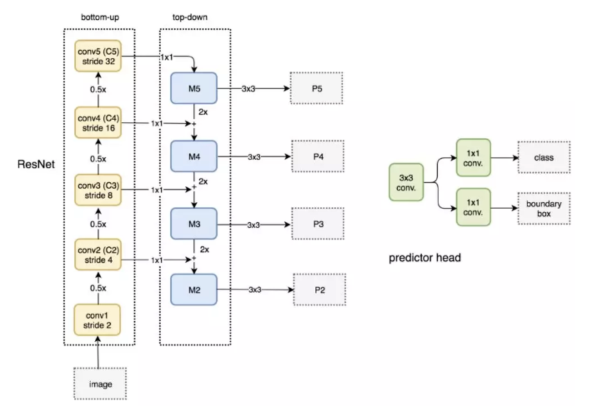

**低层的特征语义信息比较少，但是目标位置准确；高层的特征语义信息比较丰富，但是目标位置比较粗略。另外虽然也有些算法采用多尺度特征融合的方式，但是一般是采用融合后的特征做预测，而本文不一样的地方在于预测是在不同特征层独立进行的。**

1. Bottom-up pathway and Top-down pathway: Top-down 是上采样的一个过程
2. FPN for RPN：将single-scale feature map替换成FPN(multi-scale feature)，代替原来只在最后一层C5滑动卷积核

**四种类似结构：**

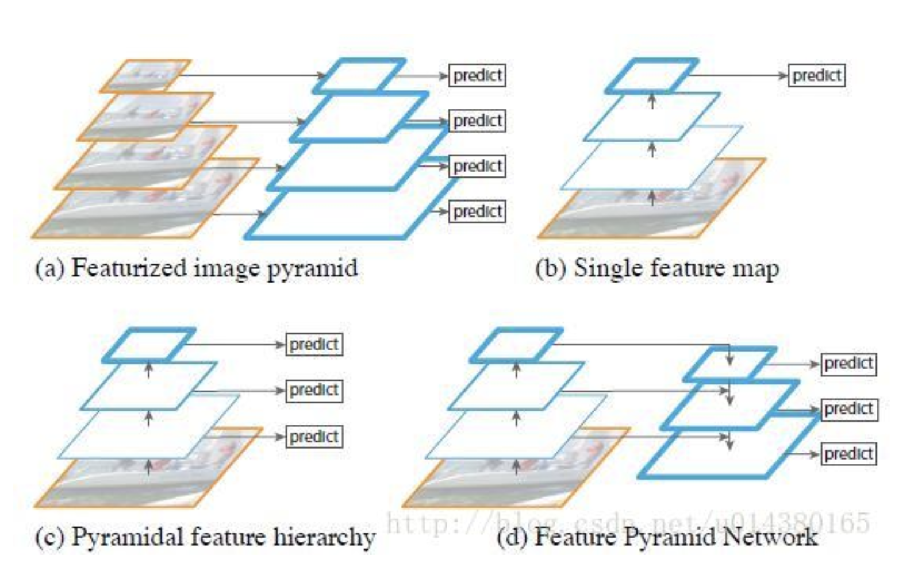

1. 图像金字塔，将图像做成不同scale并提取其对应scale的特征
2. 类似SPP net，Fast/Faster RCNN，采用最后一层特征
3. 类似SSD，从不同特征层抽取做独立预测，不增加额外计算量
4. FPN，通过上采样和低层特征融合，每层独立预测。相同大小feature map归为同一个stage

**模型结构：**

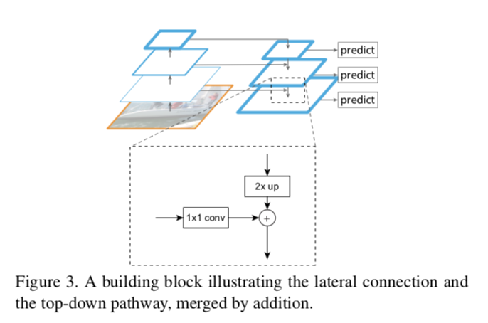

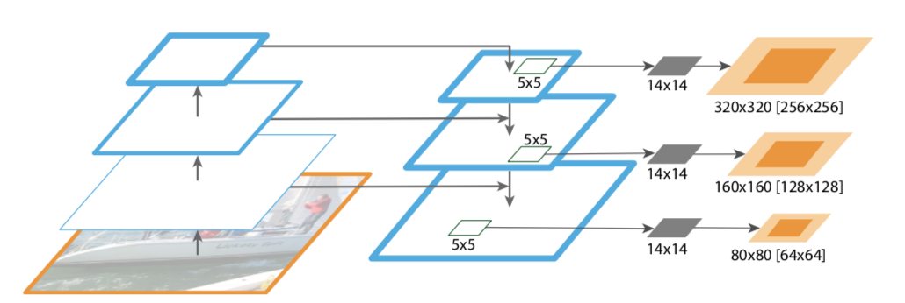

**输出：**

- **将不同层级的融合feature map输出到RPN里面作进一步ROI提取**，得到的anchors数量显著提升，AR也显著提升。

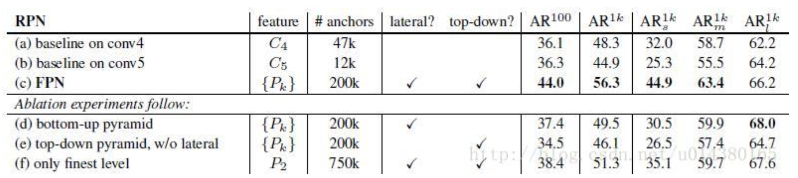

### 4. RefineDet

---

### **One-Stage：**

### 1. SSD（Single Shot Multibox Detector）

**模型特点：**

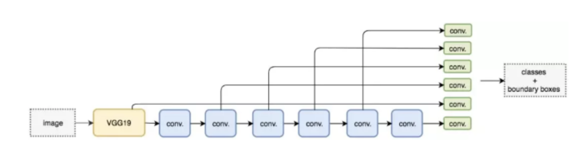

1. Default Boxes：

   1. 与Fast-RCNN中Anchor相似，不同的是SSD在多个特征层上面取Default Boxes。
   2. Default Boxes中包含location (绝对坐标)，对每个类别的confidence**包括背景**(假设c个类，这里区别于YOLO，**YOLO的类不包含背景**)。所以每个bbox需要预测4+c个值
   3. Default Boxes长宽比一般为{1,2,3,1/2,1/3}中选取
   4. 输入为图片 300x300， 在conv4_3, conv7,conv8_2, conv9_2, conv10_2, conv11_2分别提取4,6,6,6,4,4个default boxes。由于以上特征图的大小分别是38x38, 19x19, 10x10, 5x5, 3x3, 1x1，所以一共得到38x38x4(小anchor)+19x19x6+10x10x6+5x5x6(中anchor)+ 3x3x4+1x1x4(大anchor)=8732个default box.对一张300x300的图片输入网络将会针对这8732个default box预测8732个边界框。

   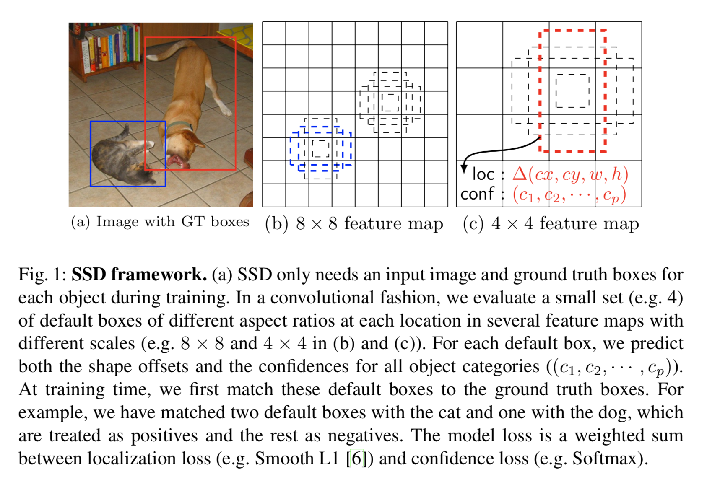

**模型结构：**

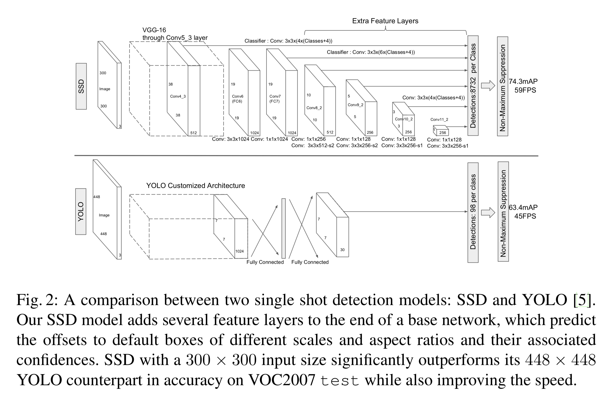

**Hard Negative Mining: **

- 因为正负样本差异巨大，我们选择将负样本按照confident score排序，选取置信度最小的default box来train，正负比达到1:3。能够有效提升收敛的效率

**Loss Function: **

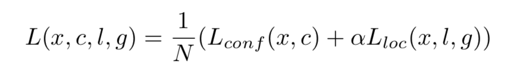

- N为bounding box数量。前一项为Bounding box与目标的confidence，后一项为相应的回归位置
- 回归采用**L1-smooth Loss**，confident loss是典型的softmax loss

**Conclusion：**

- One trick of detecting small object is **Random Crop** operation which can be thought as a "zoom in" operation.
- Multi-scale cone bounding box outputs attached to multiple feature maps at the top of the network
- **SSD300 (input size 300x300).  SSD512 (input size 512x512)**
- Future work: using **RNN** to detect and track objects in video simultaneously
- 小尺度anchor多且密集，大尺度anchor少且稀疏，输入图像无需放大去侦测小目标，计算速度更快，不忽略跨界anchor训练效果更好。

**关于Anchor的问题：**

1. anchor没有设置感受野对齐，对大目标IOU变化不大，对小目标IOU变化剧烈，尤其是感受野不够大时候，anchor有可能偏移出感受野区域，影响性能。
2. anchor必须人工给定，**尺度和比例必须覆盖相应的任务可能出现的所有目标。**

### 2. DSSD

### 3. YOLO

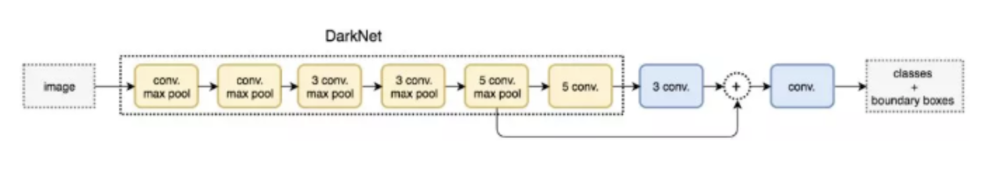

####v1

**Bounding boxes Design: **

- $x,y,w,h$ (相对坐标；相对于所属边框的x，y；相对于原始图像的w，h比例) And $ confidence$ , $confidence = Pr(Object)*IOU^{truth}_{pred}$，$Pr(Object)$ 为0或1代表存在object or not
- 若某个**GT的中心点**落入某个grid cell中，则这个格子负责预测**该物体**。每个格子输出B个bboxes信息，以及C个class中属于某个类别的概率
- 总共预测 $ S \times S \times (B * 5 + C)$ tensor，S为长宽grid数量，B为每个grid预测bounding boxes数量，C为class的总数

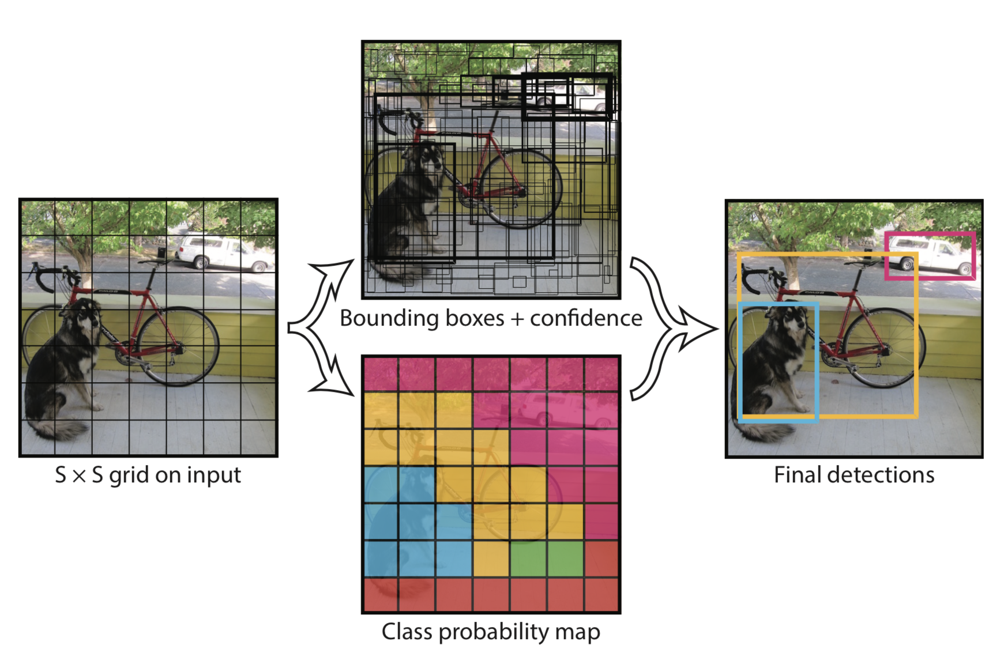

**Network Design: **

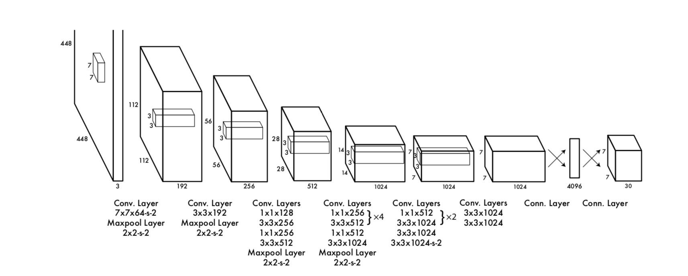

- 24 Layers Convolutional layers followed by 2 fc layers
- training method：pretrain conv on imagenet dataset

**Loss：**

- 使用均方差MSE，即网络输出$ S \times S \times (B * 5 + C)$ 维向量和GT对应的$ S \times S \times (B * 5 + C)$ 均方差
- Coord为$x,y,w,h$相对于cell的偏置，IOU为MSE

$$
Loss = \sum^{S^2}_{i=0}{CoordError + IOUError + ClassError}
$$

**Limitation：**

- 每个grid cell只能预测一个class，对临近物体或者小物体的侦测有影响。若两个中心点落入同一个格子，则选取IOU大的一个物体作为预测输出。
- 对长宽比异常的物体侦测有难度（unusual ratios and configurations）
- 大小bounding boxes的errors贡献一致，可是小的error对小的bounding box的IOU影响巨大，会最终导致定位错误

####V2

**改进：**

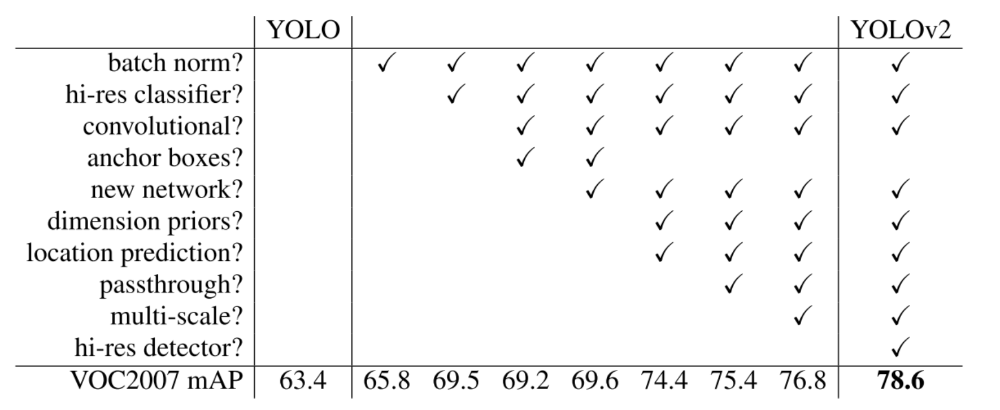

**Convolution with anchor box：**

- 摒弃FC layer，FC导致空间信息丢失
- 使用avg代替Flatten，舍弃部分池化层以换取更高的分辨率，输入分辨率为416，下采样总步长32，最终特征图为 13 x 13

**Dimension Clustering：**

- 舍弃原本的**人工筛选**anchor box尺度方法

- 对训练集做kmeans聚类获取5个聚类中心，作为anchor box的设置。

**Direct Location Prediction：**

- 使用相对坐标，不同于faster RCNN。该坐标具有网格进行约束，模型的更稳定，减少训练时间。

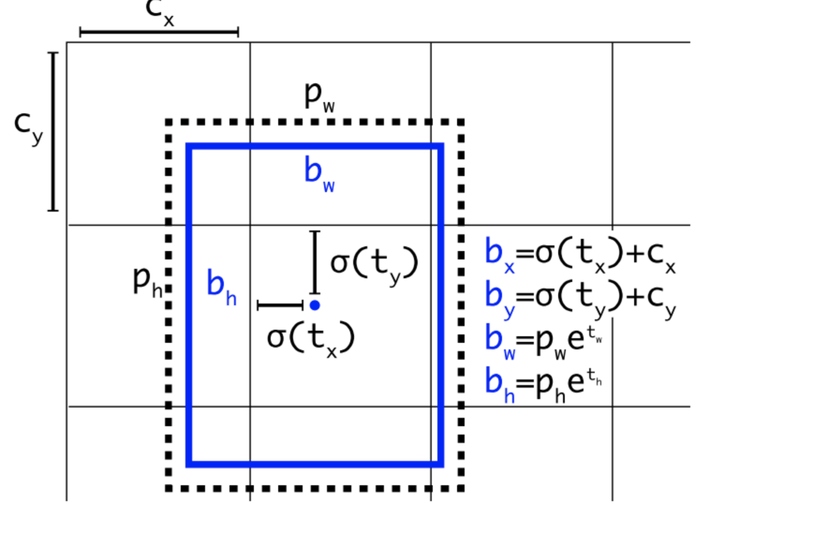

**Fine grained Feature(细粒度feature提取)：**

1. YOLOv2提取Darknet-19最后一个max pool层的输入，得到26x26x512的特征图。
2. 经过1x1x64的卷积以降低特征图的维度，得到26x26x64的特征图，然后经过**pass through层**的处理变成13x13x256的特征图（**抽取原特征图每个2x2的局部区域组成新的channel**，即原特征图大小降低4倍，channel增加4倍）
3. 再与13x13x1024大小的特征图连接，变成13x13x1280的特征图，最后在这些特征图上做预测。使用Fine-Grained Features，YOLOv2的性能提升了1%.

####V3

**改进：**

1. 新网络结构：DarkNet-53（更深的网络，残差模型），
2. 融合FPN（多尺度预测），在最后三层是用FPN得出的feature maps作为特征层
3. 用**逻辑回归**替代softmax作为分类器，因为softmax并没有对结果有提升

**模型结构：**

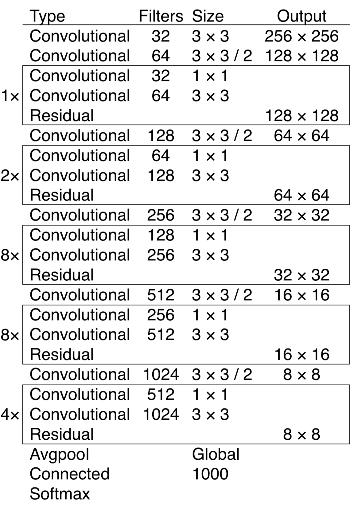

**FPN多尺度提取：**

- 在最后3个stage中提取feature map，大小分别为32x32，16x16，8x8

**模型效果：**

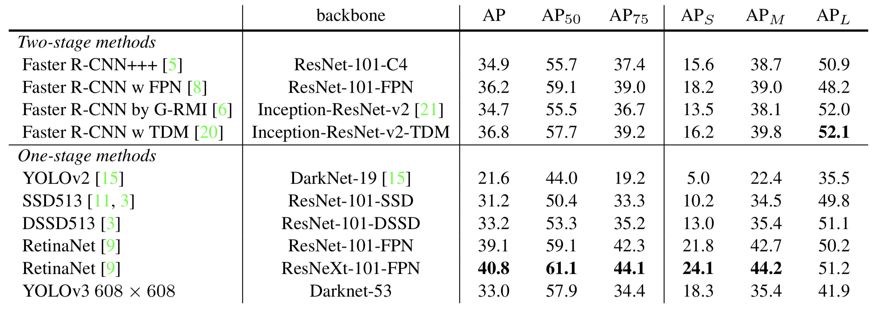

---

### 4. RetinaNet

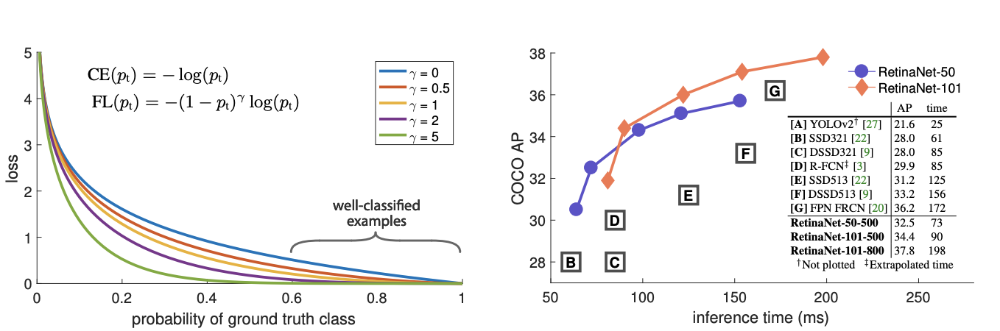

**问题所在：**

1. Single Stage Detector之所以识别率低是因为class imbalance。负样本数量远远大于正样本。

2. Negative sample数量过多导致贡献的Loss淹没了positive的Loss，即分类器将它全部分为负样本的准确率虽然高，但是召回率低。
3. 大多数训练样本为**easy negative**，非常容易被区分的背景类，单个样本loss非常小，反向计算时梯度非常小，**对收敛作用非常小**。我们需要的是hard positive/negative的大loss来促进收敛。
4. **OHEM：** 对loss排序，筛选最大的loss来进行训练。保证每次训练都是hard example

**四类example：**hard positive、hard negative、easy positive、easy negative

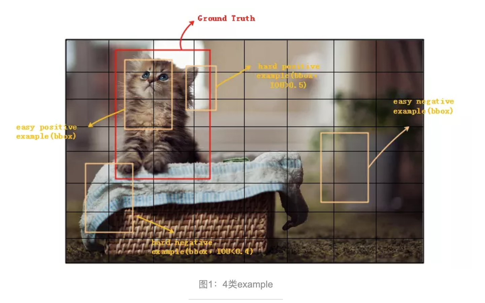

**Focal Loss**：
$$
FL(p_t)=-\alpha_t(1-p_t)^\gamma \log(p_t)
$$

1. 无论是前景类还是背景类，*$p_t$*越大，权重$(1-p_t)^\gamma$就越小。也就是说easy example可以通过权重进行抑制；

2. $\alpha_t$ 用于调节positive和negative的比例，前景类别使用 $\alpha_t$ 时，对应的背景类别使用 $1-\alpha_t$ ；
3. $\gamma$ 和 $\alpha_t$ 的最优值是相互影响的，所以在评估准确度时需要把两者组合起来调节。作者在论文中给出$\gamma=2$ $\alpha_t = 0.25$ 时，ResNet-101+FPN作为backbone的结构有最优的性能。

**RetinaNet结构：**

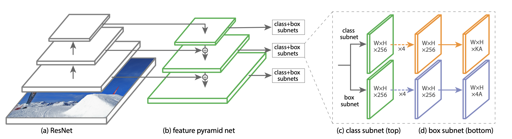

- ResNet+FPN

---

### 5. RFBNet

**模型特点：**

1. 模拟人类视觉的感受野加强网络的特征提取能力，RFB利用空洞卷机模拟复现人眼**<u>pRF尺寸和偏心率</u>**之间的关系。**<u>卷积核大小和膨胀率与pRF尺寸和偏心率有着正比例关系</u>**。
2. 借助了split-transform-merge的思想，在Inception的基础上加入了dilated conv，增大了感受野
3. 整体**基于SSD**进行改进，速度快而且精度高（VGG的精度能与two-stage ResNet 精度相提并论）

**Receptive Field Blocks：**

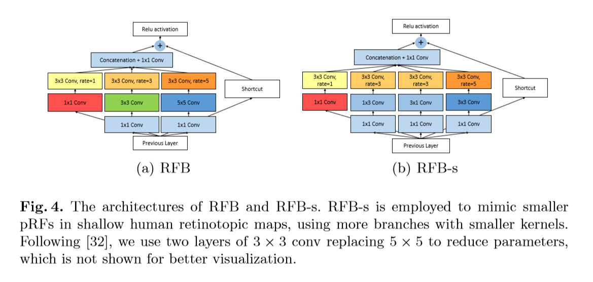

- 左：在第一层卷积层后面增加dilated conv，最后concate之后过一个1x1 Conv

- 右：**使用1x3 和 3x1的kernel替代 3x3 conv**，减少参数。**使用两个3x3 conv替代5x5 conv**，图中没有显示出来是为了更好的visualization

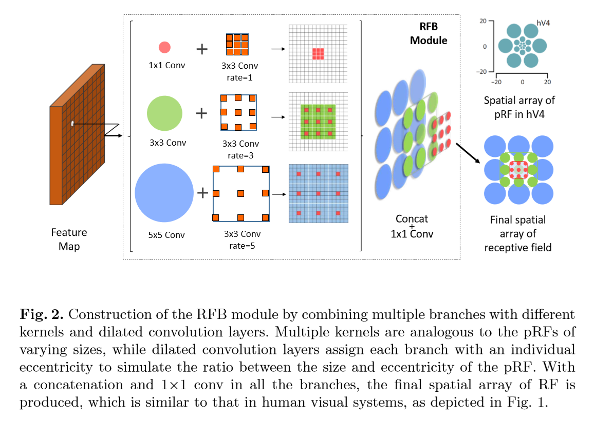

**模型：**

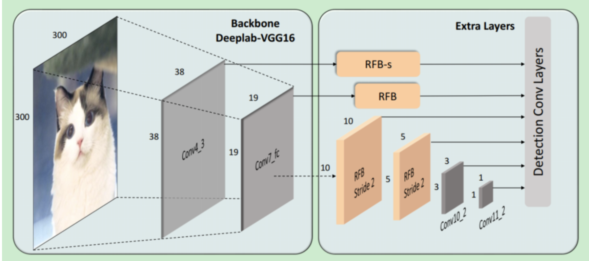

1. 将SSD主干网络中conv8，conv9替代为RFB
2. 将conv4_3，conv7_fc后分别接入RFB-s和RFB结构

**模型对比：**

- Inception：单纯的用不同size的conv 并将Feature map concate。感受野从中心发散，**没有偏心率的体现**
- ASPP：将不同rate的dilated conv叠加，感受夜中心发散，可是感受范围小。**pRF尺寸过小**
- Deformable：使用偏置项使conv能够解决空间一致性的问题，RF能够自适应object特征
- RFB：使用dilated卷积，平衡了a，b两者的优点。

---

### 6. Region based Fully Convolutional Network(R-FCN)

**模型结构：**

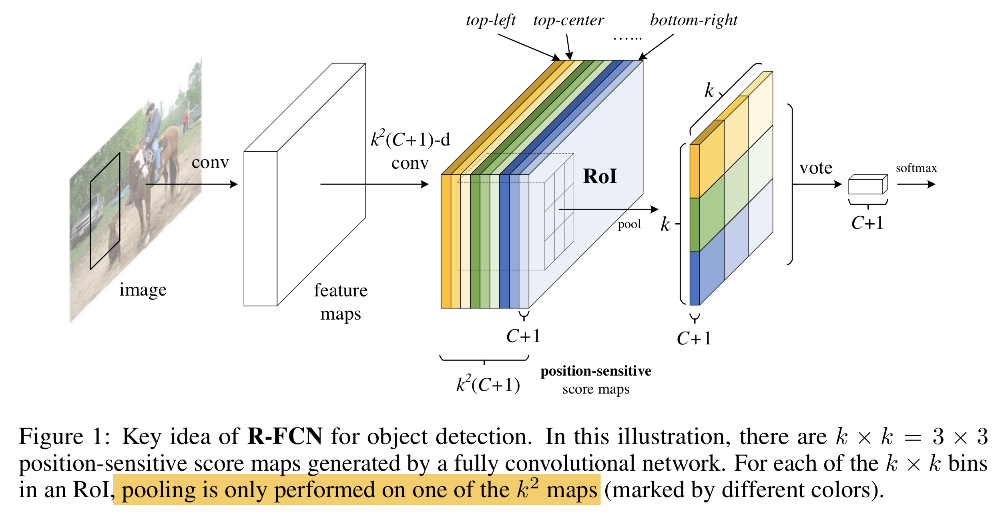

**模型特点：**

1. 在最后一层的feature map上做卷积运算，channel为 $k^2(C+1)$ 。与之**平行的还有一个RPN分支**生成ROIs

   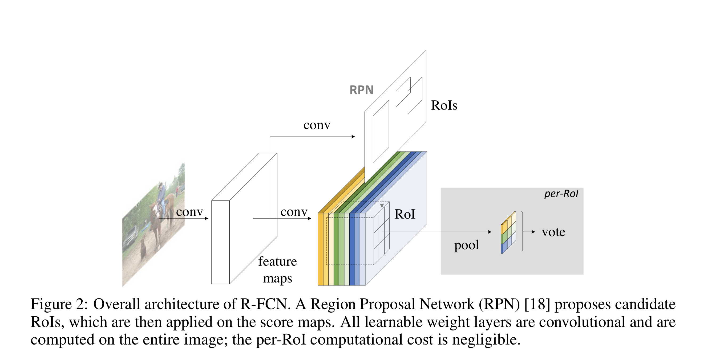

2. $k^2$ 为每一个class的position score map，一共`C+1` 个类别包括背景

3. 之后通过position sensitive ROI Pooling，为每一个ROI生成相对应Score

**Position-sensitive score maps & Position-sensitive RoI pooling：**

- 将ROI分隔成$k \times k$ bins，如果ROI大小为$w \times h$，则每个bins约为$\frac{w}{k} × \frac{h}{k} $
-  Pooling对于第(I, J)个bin的操作，c为第c-th个class：

$$
r_c(i,j|\theta) = \sum_{(x,y)\in bin(i,j)}z_{i,j,c}(x+x_0,y+y_0|\theta)/n
\\ \
\\
z_{i,j,c} 是k^2(C+1)其中的一个通道，n是一个bin里pixels数量
$$

- 作用于entire images，区别于之前的ROI只作用在ROI区域。

### 7. Pooling Pyramid Network（SSD改进）

**模型结构：**

- shared tower：输入为19×19, 10×10, 5×5, 3×3, 2×2, and 1×1的feature map通过1x1x512 卷积核
- 训练：
  - L1-smooth for box regression
  
  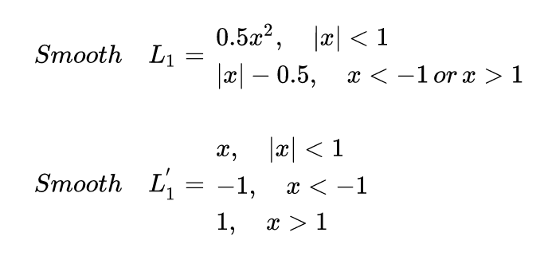
  
  - Focal Loss $\alpha = 0.25 $ , $\gamma = 2$

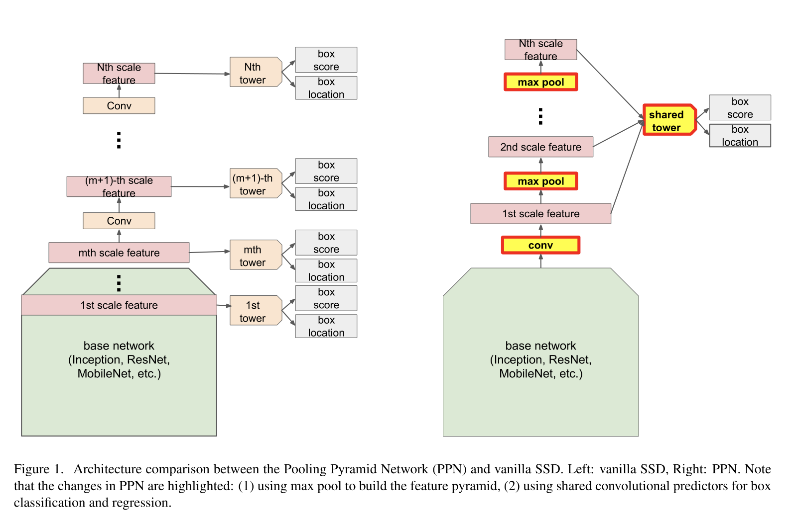**模型特点：**

- **使用max pooling构建feature pyramid** 代替conv特征提取。更快，共享embedding space
- 将多个box detector减少至一个，避免了跨尺度的分类器的分数错误校准
- 与SSD效果相同，但是size小3倍

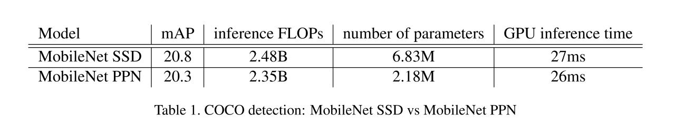

**疑问：**

1. shared tower怎么操作不同尺寸的feature map

### 8. Feature Selective Anchor-Free Module for Single-Shot Object Detectio

模型结构：

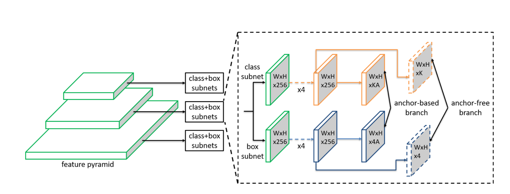

- 内含anchor-based和anchor-free模块（A为anchor个数，K为class num）

监督训练信号（supervision signal）：

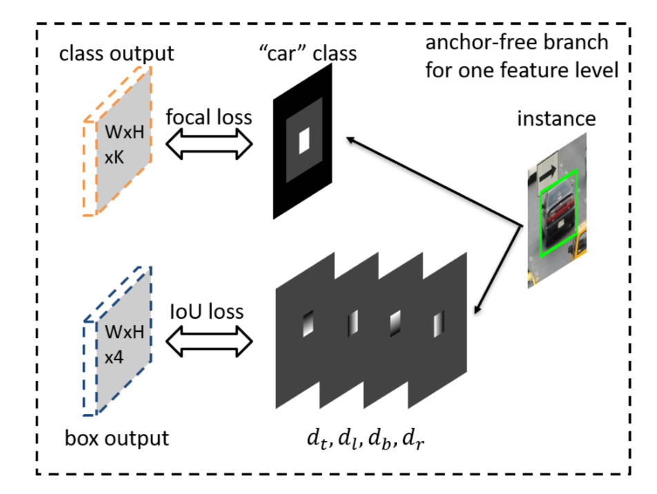

1. ground truth box：k
2. ground truth box 坐标：$b = [x,y,w,h]$
3. ground truth box 在第$l$层上的投影：$b_p^l=[x_p^l,y_p^l,w_p^l,h_p^l]$
4. effective box：$b_e^l=[x_e^l,y_e^l,w_e^l,h_e^l]$，他表示$b_p^l$的一部分，缩放系数比例 $\epsilon_e = 0.2$
5. ignoring box：$b_i^l=[x_i^l,y_i^l,w_i^l,h_i^l]$ ，他表示$b_p^l$的一部分，缩放系数比例 $\epsilon_i = 0.5$

- Classification Output

  - effective box 表示positive区域，如图白色部分所示。$b_i^l - b_e^l$ 这个部分ignoring区域不参与分类任务，如图灰色部分所示。剩余黑色部分为negative。分类任务是对每个像素做分类，考虑到正负样本不均衡，采用Focal Loss

- Box Regression Output

  - 输出4个offset map。这里取的是像素（i，j）与$b_p^l$ 四个边框的距离。gt bbox 只影响了$b_e^l$区域，所以这里（i，j）是该区域的所有像素。回归分支采用的是IOU Loss

    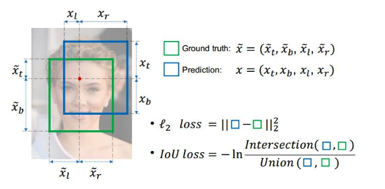

- Online Feature Selection

  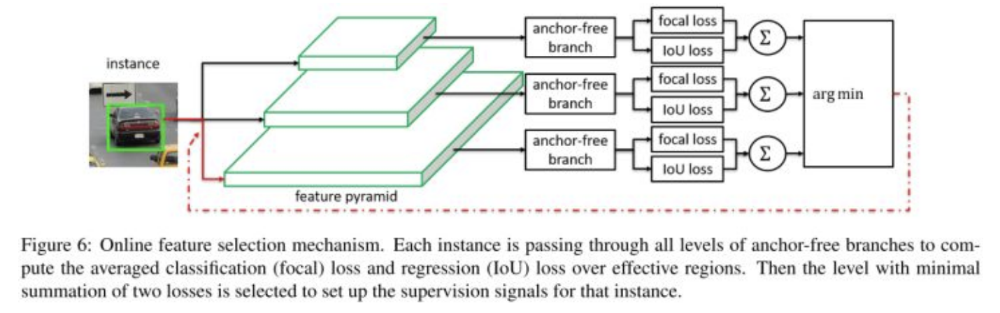
  
  1. 实例输入到金字塔所有层，求得IOU loss和focal loss的和
  2. 选取loss和最小的层来学习实例得到feature map
  3. 训练时，特征根据安排的实例进行更新。
  4. 推理时，不需要进行特征更新，因为最适合学习的金字塔层自然输出最高置信分数。