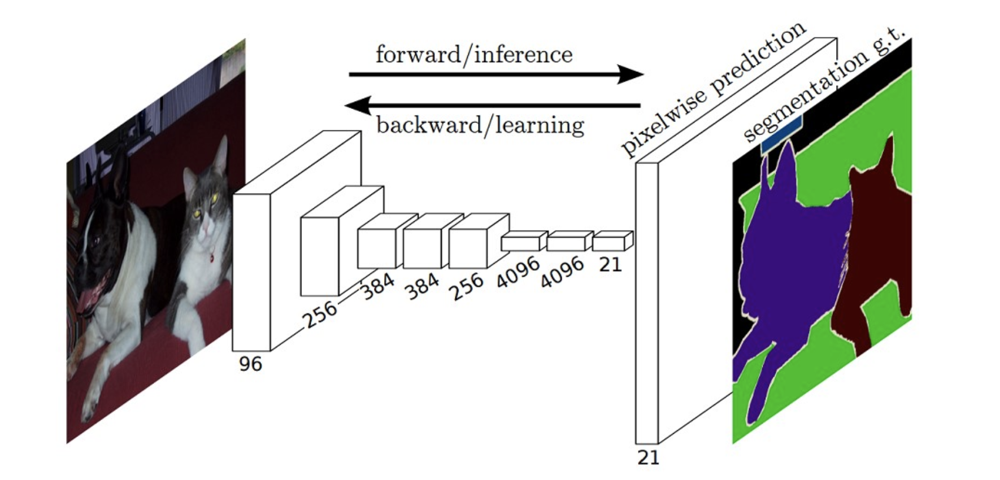
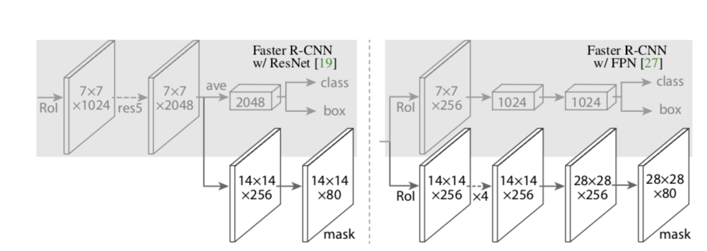
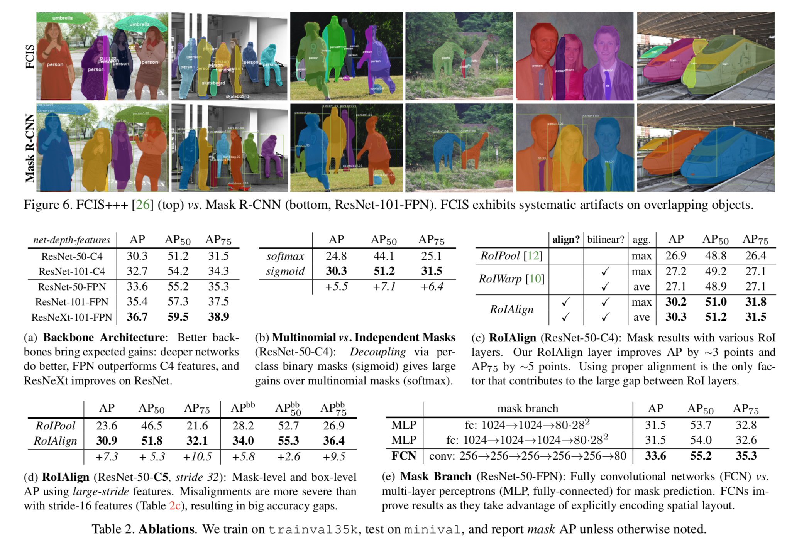

## Object Segmentation Models

### 1. FCN

模型特点：

- 采用反卷积对最后一层的feature map进行上采样(up-sampling)使他恢复到与输入相同尺寸，保留了原输入图像的空间信息，最后在up sampling(反卷积 deconvolutional) 的特征图上进行逐帧的像素分类--pixel wise **softmax** prediction (**softmax loss**)。
- 属于语义分割 **(Semantic Segmentation)**

### 2. U-Net

### 3. SegNet

### 4. RefineNet

### 5. PSPNet

---

### 6.Mask-R-CNN

模型特点：

- Two-stage which is same as Faster-RCNN

  1. RPN proposes candidate object bounding boxes
  2. extreacts features using RoIPool from each candidate box and performs classification and bounding-box regression

- **Binary mask for each RoI**

  - $RoI Lost Function:	L = L_{cls} + L_{box} + L_{mask}$
  - Mask branch (**FCN** layers) has a $Km^2$ dimensional output for each RoI (resolution $m*m$), K for K classes
  - 通过**FCN**生成mask，然后再逐帧做**pixel-wise sigmoid**

- **RoIAlign**

  - **保留浮点数**，用除法将region proposal平均分成kxk个。
  - 不在pixel边界的点使用**双线性插值**计算得出。
  - 解决了misalignment的问题，该问题在分类问题中影响不大。但在pixel级别分割问题中存在较大误差，特别是针对小物体
  - Mask path可以嵌入各种**Head Architecture**

  

- Multinomail vs. Independent Masks

  - OvR分类的效果优于OvO的效果 (Sigmoid 属于二分类, 其他classes对loss不产生影响，binary loss)
  - softmax为概率loss

- Class-Specific vs. Class-Agnostic Masks

  - Class-Specific: one mxm mask per class
  - Class-Agnostic: single mxm output regardless of class

- Main Results

